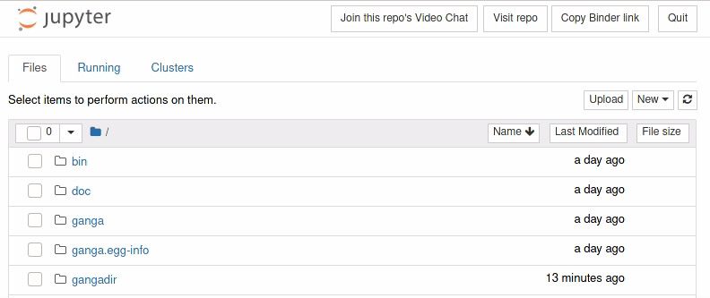
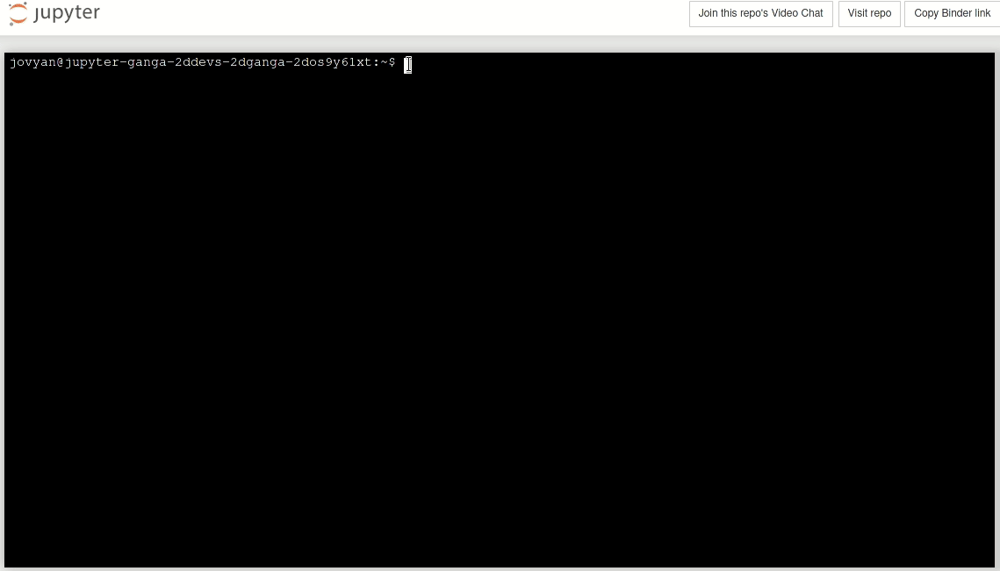

Install and Basic Usage
=======================

Installation
------------

There are several ways to install and run Ganga:

**NOTE -** Currently Ganga is only available for python3 releases and supported on Linux distributions.

Binder
^^^^^^

For testing, you can run Ganga within the Binder service. Simply follow the link https://mybinder.org/v2/gh/ganga-devs/ganga/BinderTutorial and in a terminal start Ganga. The parts of Ganga that connects to remote services will be limited due to the restricted connectivity of the Binder containers.

CVMFS
^^^^^

If you have access to CVMFS, Ganga can be found at ``/cvmfs/ganga.cern.ch/``. This will be kept up-to-date with the
latest release that you can run directly with:

``/cvmfs/ganga.cern.ch/runGanga.sh``

This isn't just a link to the start-up script because it needs to be run from the correct directory. However,
it will take all the command line options that the normal ganga script takes.

PyPI Install
^^^^^^^^^^^^
(Recommended)

The best is to install inside a virtual environment

.. code-block:: bash

    # Create a virtualenv
    python3 -m venv gangaenv
    cd gangaenv/
    . bin/activate

    # Update installation tools to latest and greatest
    python3 -m pip install --upgrade pip setuptools wheel

    # Install Ganga 
    python3 -m pip install ganga

To install pip locally if it's not on your system and you don't have admin access please consult: https://pip.pypa.io/en/stable/installing/

Now each time you want to use Ganga in a new shell, you have to activate the virtual environment:

.. code-block:: bash

    cd gangaenv/
    . bin/activate
    ganga

From Github
^^^^^^^^^^^

.. code-block:: bash

    # Create a virtualenv
    python3 -m venv gangaenv
    cd gangaenv/
    . bin/activate

    # Update installation tools to latest and greatest
    python3 -m pip install --upgrade pip setuptools wheel

    # Clone Ganga 
    git clone git@github.com:ganga-devs/ganga.git

    # Install dependencies
    cd ganga
    python3 -m pip install -e .

Starting Ganga
--------------

As described above, to run Ganga simply execute ``ganga`` (for PyPI install), ``<installdir>/bin/ganga``
(for other installs) or the helper script in CVMFS. This will start Ganga and it's associated threads as
well as provide you with a Ganga IPython prompt that gives you access to the Ganga Public Interface (GPI) on
top of the usual IPython functionality:

.. code-block::
    *** Welcome to Ganga ***
    Version: 8.3.3
    Documentation and support: http://cern.ch/ganga
    Type help() or help('index') for online help.
    
    This is free software (GPL), and you are welcome to redistribute it
    under certain conditions; type license() for details.
    
    
    INFO     reading config file /home/egede/.gangarc
    INFO     reading config file     /cvmfs/ganga.cern.ch/Ganga/install/8.3.3/lib/python3.6/site-packages/ganga/GangaLHCb/LHCb.ini
    INFO     reading config file /cvmfs/lhcb.cern.ch/lib/GangaConfig/config/8-0-0/GangaLHCb.ini
    INFO     Using LHCbDirac version prod
     === Welcome to Ganga on CVMFS. In case of problems contact lhcb-distributed-analysis@cern.ch === 

Note that the first time you run Ganga it will ask you to create a default ``.gangarc`` file which you should
probably do. In the future, if you want to recreate this default config file, add the option ``-g`` to the command line.

In Binder you start ganga in a terminal as illustrated in the image below

Getting Help
------------

The documentation for all objects and functions in Ganga can be accessed using the help system:

.. code-block:: python

    [13:25:29]
    Ganga In [1]: help()
    ************************************

    *** Welcome to Ganga ***
    Version: 8.3.3
    Documentation and support: http://cern.ch/ganga
    Type help() or help('index') for online help.

    This is free software (GPL), and you are welcome to redistribute it
    under certain conditions; type license() for details.

    This is an interactive help based on standard pydoc help.

    Type 'index'  to see GPI help index.
    Type 'python' to see standard python help screen.
    Type 'interactive' to get online interactive help from an expert.
    Type 'quit'   to return to Ganga.
    ************************************

Now typing ``index`` at the prompt will list all the objects, etc. available. You can also directly access the
documentation for an object using ``help`` directly:

.. literalinclude:: ../../ganga/GangaCore/test/GPI/TutorialTests.py
    :start-after: # -- INSTALLANDBASICUSAGE HELP START
    :end-before: # -- INSTALLANDBASICUSAGE HELP STOP
    :dedent: 8

You can also use IPython's tab-complete to help identify members of an object.

Hello World with Ganga
----------------------

We are now in a position to submit our first job. This will take the defaults of the Ganga Job object which is
to run ``echo 'Hello World'`` on the machine you're currently running on:

.. literalinclude:: ../../ganga/GangaCore/test/GPI/TutorialTests.py
    :start-after: # -- INSTALLANDBASICUSAGE SUBMIT START
    :end-before: # -- INSTALLANDBASICUSAGE SUBMIT STOP
    :dedent: 8

If all goes well, you should see the job submit:

.. code-block:: python

You can view the job in your repository using the ``jobs`` command which lists all job objects that Ganga knows about:

.. code-block:: python

    Ganga In [1]: jobs
    Ganga Out [1]:

    Registry Slice: jobs (1 objects)
    --------------
        fqid |    status |      name | subjobs |    application |        backend |                             backend.actualCE |                       comment
    -------------------------------------------------------------------------------------------------------------------------------------------------------------
           0 | completed |           |         |     Executable |          Local |                       epldt017.ph.bham.ac.uk |

    [13:34:37]
    Ganga In [2]:

You can get more info about your job by selecting it from the repository:

.. literalinclude:: ../../ganga/GangaCore/test/GPI/TutorialTests.py
    :start-after: # -- INSTALLANDBASICUSAGE JOBS START
    :end-before: # -- INSTALLANDBASICUSAGE JOBS STOP
    :dedent: 8

You can also select specific info about the job object, e.g. the application that was run:

.. literalinclude:: ../../ganga/GangaCore/test/GPI/TutorialTests.py
    :start-after: # -- INSTALLANDBASICUSAGE JOBSAPP START
    :end-before: # -- INSTALLANDBASICUSAGE JOBSAPP STOP
    :dedent: 8

To check the ``stdout/stderr`` of a job, you can use the peek method

.. code-block:: python

    j = jobs(0)
    j.peek('stdout')

Copy a job
----------
You can copy and old job, modify its attributes anbd then submit it as a new one

.. code-block:: python

    j = jobs(0).copy()
    j.application.args = ['Hello from a copy']
    j.name = 'Copy'
    j.submit()

    
Job Monitoring
--------------

While Ganga is running in interactive mode, a background thread goes through all your active jobs and checks
to see what state they are in. Generally, jobs will transition from new -> submitted -> running -> completed/failed.
As described above, the `jobs` command will show you the state of your jobs in the Ganga repository.

Scripting and Batch Mode
------------------------

You can put your ganga commands into a python script

.. code-block:: bash

    [centos7] ~ % cat >> myfile.py
    j = Job()
    j.submit()
    ^D

and then execute it from the Ganga prompt like this
    
.. code-block:: python

    runfile('myfile.py')

In addition, Ganga can be run in batch mode by just providing a script as the last argument:

.. code-block:: bash

    [centos7] ~ % ganga myfile.py

Note that by default, the monitoring is turned off while in batch mode.
