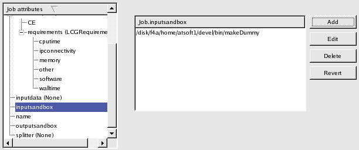
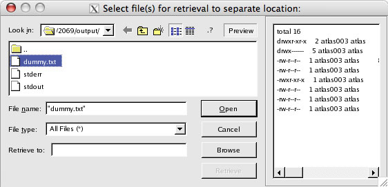
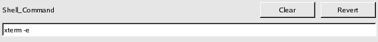

=====================
GANGA GUI User Manual
=====================

:Author:        Chun Lik Tan (clat@hep.ph.bham.ac.uk)
:Instituition:  University of Birmingham
:Version:       1.1.x
:Ganga Version: 4.1.x
:Modified:      9 March 2006
:Bugs:          Report bugs to Savannah_
:Website:       http://ganga.web.cern.ch

Contents
========

- Introduction_
- `Quick Start`_
- `Getting around`_
   - Menubar_
   - Toolbar_
   - Monitoring_
   - `Job Builder`_
      - Templates_
      - Splitters_
   - Scriptor_
   - Log_
- Examples_
   - `Generic job`_
   - `ATLAS job`_
   - `LHCb job`_
- `GUI Customisation`_
   - `General configurations`_
      - `File associations`_
      - `Invoking external applications`_
   - `Monitoring configurations`_
      - `Status colour schema`_
   - `Job Builder configurations`_
   - `Scriptor configurations`_
   - `Log configurations`_
   - `Logical Folder configurations`_
- FAQ_

Introduction
============

GANGA GUI is the GUI (Graphical User Interface) front-end to GANGA_ allowing users not comfortable working at the console the choice to work in a graphical environment. It is developed with PyQt_ (Python-bindings to the Qt_ graphical toolkit) and is built on top of the GANGA GPI (GANGA Public Interface).

GANGA GUI not only allows the user to build a GANGA job, submit it (i.e. execute it) locally or to a selection of distributed systems (e.g. batch systems, the Grid) and subsequently retrieve the results, it also provides a customisable job monitoring window that keeps track of running jobs and their status, a job management facility to organise past jobs and quick-scripting tools to run favourite code snippets all within an integrated graphical environment.

Quick Start
===========
In this section, you will submit a simple GANGA ``Hello World`` job just to get a feel of how the GANGA GUI works.

Step 1 - Start GANGA GUI
------------------------
At the console, start GANGA with the GUI as the front-end by giving the ``--gui`` argument::
      
   $ ganga --gui

If it's your first time running GANGA, you will be presented with the following lines::

   *** Welcome to Ganga ***
   Version: CVS_HEAD
   Documentation and support: http:/cern.ch/ganga
   Type help() or help('index') for online help.
   
   It seems that you run Ganga for the first time and you do not have the
   config file: ~/.gangarc
   
   Would you like to create config file with standard settings ([y]/n) ?y
   Created standard config file /home/clat/.gangarc
   
   Press <Enter> to continue.

As requested, create a new GANGA config file with standard settings and hit **Enter** to continue. There may be more log messages filling your console window but you will eventually be presented with a GUI that looks much like this:

.. figure:: quickstart_pic_1.jpg
   
   Figure 2-1: Ganga GUI start-up view

Step 2 - Build job
------------------
To create a new GANGA job, click on the |New Job| icon (leftmost icon on the toolbar).

The Job Builder window (see Figure 2-2) will appear allowing you to build a new GANGA job. In this example, Job 2068 was created showing a list of *Job attributes*. Expand the application attribute to reveal its constituent attributes. Click on *exe* and you will see that this job will run the executable ``echo``. Click on *args* to see the argument (*Hello World* in this case) that will be passed to the executable.

   Figure 2-2: Creating a new job with the Job Builder.

The *monitoring* panel (i.e. the table-like widget with headings just below the toolbar) in the main GANGA GUI window, will correspondingly show the new job that you have just created.

.. figure:: quickstart_pic_3.jpg
   
   Figure 2-3: Newly created job in the monitoring panel.

Step 3 - Submit job
-------------------
You are now ready to submit the *Hello World* job. To submit, simply click on  |Submit button| in the Job Builder window (top-right corner).

In the *monitoring* panel, the job's status will change and eventually become *completed*.

   Figure 2-4: Job has successfully completed.

Step 4 - Retrieve result
------------------------
To retrieve the job's output, right-click on the job entry (in the *monitoring* panel) and select *Retrieve output* to display the *Retrieve output* dialog box. 
Select the *stdout* file and click on the |Preview| button (top-right corner) in the dialog box to preview its contents.

.. figure:: quickstart_pic_5.jpg

   Figure 2-5: Retrieve output of the job.

To save the output file (i.e. *stdout*) to a separate location, click on the |Browse| button and choose a directory from file browse dialog. Once a directory is selected, click on the |Retrieve| button.

Getting around
==============
The GANGA GUI is designed with component windows that can be undocked from the main window to allow you to customise its layout according to your needs. The GANGA GUI is made up of several components:
   - Menubar_
   - Toolbar_
   - Monitoring_
   - `Job Builder`_
   - Scriptor_
   - Log_

.. TIP:: 
   Tooltips will appear when you move the mouse pointer over most widgets. This is a great way to understand what they are and how to use them. You may have to move the mouse over the headers of list widgets to see their associated tooltips.

Menubar
-------
Menu items are divided into job actions (Job), logical folder management actions (Folders), GUI management and configuration actions (View) and application assistance (Help).

   Figure 3-1-1: Job-related actions. 

   Figure 3-1-2: Logical Folder management actions.

   Figure 3-1-3: GUI management and configuration actions.

Toolbar
-------
The toolbar provides quick access to job-related actions and also allows basic GUI component management (i.e. dock, undock and hide actions)

   Figure 3-2-1: Description of the various buttons and icons in the toolbar.

Monitoring
----------
The *monitoring* panel provides a centralised view of all existing GANGA jobs. It provides information on individual jobs and checks for changes in the monitored fields for all jobs in transient states (i.e. *submitted* and *running* job states). Together with the menubar and toolbar, the *monitoring* panel constitutes the GANGA GUI main window.

The *monitoring* panel also has the *logical job folders* panel attached on its left (click on |Toggle logical job folders| button to reveal *logical folders* panel) and the job details description panel attached on its right (click on |Toggle job details| button to reveal *job details* panel) .

   Figure 3-3-1: A typical view of the monitoring panel with logical job folder organiser (left) and job details (right).

.. _`subjob notes`:

.. Note::
   Jobs (when defined and submitted with specialised Splitters_) can contain one or more subjobs. These jobs (also known as *master jobs*) will be displayed in the *monitoring* panel as job entries that can be expanded. When expanded, its subjobs are displayed accordingly. As there may be many (possibly several thousand) subjobs for a single master job, monitoring of subjobs is only enabled for visible subjobs (i.e. when the corresponding master job is expanded). This helps to reduce the performance impact of subjob monitoring when it is not required.

Customising headers
"""""""""""""""""""
To change the headers in the *monitoring* panel, simply *right-click* within the *monitoring* panel display widget and select *Modify headers* from the context-sensitive menu. A list of possible headers will appear in a pop-up window. Simply select headers you are interested in and click *OK*. Job *id* and *status* are mandatory fields and so cannot be changed. You can also change the displayed text of a particular header by *left-clicking* once on a particular text in the *Displayed Text* column.

   Figure 3-3-2: Select fields to display in the monitoring panel. Displayed text can be changed as well.

.. TIP::
   In the monitoring panel, the arrangement of header fields can be changed by simply *left-click and hold* on to a particular header and *drag* it to the desired position.

.. TIP::
   *Left-clicking* on a particular header will sort the list of jobs in that particular order (e.g. clicking on *status* will sort according to status). Clicking again will reverse that order.

Logical job folders
"""""""""""""""""""
Logical job folders help to organise jobs into logical collections. Nested folders can be created if it is deemed useful. Existing jobs can be freely added and removed from logical folders as such actions have no bearing on the actual jobs themselves. *Right-clicking* on logical folders and jobs will reveal a context-sensitive menu of appropriate actions. Figure 3-3-3 shows the various actions that can be initiated on a logical folder. Jobs and logical folders can be moved around by mean of the *drag and drop* facility; jobs can be dragged from the *monitoring* panel and dropped onto a logical folder.

   
   Figure 3-3-3: Logical job folder - A job management feature.

Searching
"""""""""
When the number of jobs increase, it becomes useful to be able to search for particular jobs. The *monitoring* panel includes just such a search facility that will search for jobs with details (currently displayed in the *monitoring* panel) that contain the specified string. 

   
   Figure 3-3-4: Search facility locates strings in the monitoring panel.

Job Builder
-----------
The job builder is designed to assist in the GANGA job building process. Various attributes of a GANGA job are presented in a nested (tree) list reinforcing the relationship between the various attributes and ensuring that all attributes can be easily accessed.

The job builder is a *dockable* window which is initially hidden. It becomes visible when a new job is created (i.e. using the |New Job| button in the toolbar or menu bar).

.. figure:: jobbuilder_pic_1.jpg

   Figure 3-4-1: GANGA job builder

.. TIP::
   To undock windows (i.e. Job Builder, Scriptor and Log windows), *double-click* on the docked window's left vertical border (the left border of each docked window looks slightly different/thicker). To do the reverse (i.e. to dock a floating window), simply *double-click* on the window's title bar (i.e. it's top edge).

The job builder window consists of a top row of multi-function tool buttons (i.e. left-clicking and holding these buttons will reveal a menu of additional functions). Tool buttons with more than one function are typically denoted by ellipsis-trailing text on the tool button (e.g. *New...*, *Save...*).

   Figure 3-4-2: Job builder tool buttons.

The |Kill|, |Remove| and |Submit| tool buttons are single function buttons that perform *kill*, *remove* and *submit* actions on the job concerned respectively.

Clicking on the |New...| tool button creates a new job. Clicking and holding the tool button reveals an additional menu that allows the creation of a new job based on existing Templates_.  

   Figure 3-4-3: The New... multifunction tool button.

Clicking on the |Save...| tool button saves the job currently being built. Clicking and holding the tool button reveals an additional menu that allows the creation of a copy of the current job and the saving of the current job as a template.

   Figure 3-4-4: The Save... multifunction tool button.

Templates
"""""""""
Job templates are designed to store jobs of particular interest which will typically be used to create other similar jobs. Templates can be removed by navigating to *Job > Remove Template* and selecting a template.

   Figure 3-4-5: Naming a new job template.

Splitters
"""""""""
Jobs may be split into smaller fragments to take advantage of distributed system backends (e.g. LCG, LSF). This can be easily achieved by filling in the *splitter* attribute of a job. To select a suitable splitter, click on the *splitter* attribute to highlight it. You will be presented with a selection of available splitters. Say we select the *ExeSplitter* (a simple splitter created for the sole purpose of illustrating the splitting mechanism and not for normal use). *ExeSplitter* has a single configurable attribute *apps*. Navigating to *apps*, we see that a selection of applications can be added to the list using the *Add* button. Six individually configurable applications have been added to the *apps* list in the example shown in Figure 3-4-6 below.

   Figure 3-4-6: Creating a job that will split into several subjobs.

When this job is submitted, the new job entry in the *monitoring* panel will be made expandable. Expanding this *master* job will revealing it's subjobs. Once subjobs are revealed, they will be monitored as well i.e. their status will be checked and updated. See `subjob notes`_.

   Figure 3-4-7: Master job with several subjobs running.

Scriptor
--------
The scriptor is a convenience tool which includes the *favourites* script store (top-left section), scripting panel with execute button (top-right section) and the interactive Python session (lower-half section).

   Figure 3-5-1: Scriptor - favourites script store (with context-sensitive menu), scripting panel and interactive Python session.

The *favourites* script store is a store for code snippets designed for quick and easy access. Choose a script from the *favourites* script store by simply *clicking* on it and its contents will be displayed in the scriptor window (right of script store). 

*Right-clicking* in the script store will reveal a list of possible actions (see Figure 3-5-1 above):

   | *Exec*
   |    Execute the selected script.
   | *New*
   |    Create an empty entry in the script store.
   | *Clone*
   |    Make a copy of an existing script.
   | *Remove*
   |    Delete the currently selected script store entry.
   | *Import*
   |    Load a script from an existing file.
   | *Export*
   |    Save a selected script to disk.

.. TIP:: 
   Descriptions can be added to existing scripts in the script store by *left-clicking* on the *Description* column of a particular script and entering the desired text.

The scripting panel is essentially a scratch pad for GANGA/Python commands allowing you to conveniently create and execute (using the *Execute* button) snippets of code within the same GANGA session (i.e. all jobs you create, modify or remove will be reflected in the *monitoring* panel). This is useful for anything from the occasional experimentation to customised bulk job submissions not catered for by existing Splitters_.

The interactive Python session window is an emulated Python shell. It is in this shell that scripts edited in the scripting panel are executed. Use the interactive Python session as you would with a normal Python shell. 

.. NOTE::
   You will not be able to exit from the interactive Python shell.

Log
---
The log window displays all log messages that would normally be displayed on the console from which GANGA was executed.

Examples
========
Below are step-by-step examples of three different types of jobs being built and run using the GANGA GUI.

   - `Generic job`_
   - `ATLAS job`_
   - `LHCb job`_

Generic job
-----------
This is an extension to the *Hello World* job described previously. This time, you will get to build a generic job, run it and retrieve its results.

In this example, we have a very simple script called *makeDummy* which dumps the contents of the directory it is currently in into a file called *dummy.txt*. You can download it from here__ (you may have to *right-click* on the link and save it explicitly). We will now build a GANGA job that will run this script on LCG.

__ http://ganga.web.cern.ch/ganga/GangaGUI/scripts/makeDummy
.. IMPORTANT::
   You will need a valid grid certificate to submit jobs to LCG.

Step 1 - Build job
""""""""""""""""""
Click on the |New Job| icon on the toolbar.

The Job Builder window (if it's not already visible) will appear allowing you to build a new GANGA job. As before, you will be presented with a list of *Job attributes* for the new job you have just created.
 
   1. Expand the *application* attribute to reveal its constituent attributes. 
   2. Click on *exe* and replace the current value with *makeDummy*.

.. figure:: genericjob_pic_1.jpg

   Figure 4-1-1: Change the exe value to makeDummy.

   3. Click on *args* and delete the existing *Hello World* argument (using the delete button on the right) as our *makeDummy* script does not take any arguments.
   4. The *backend* attribute should (currently) be set to *Local*. Change this to *LCG*. You may see what constituent attributes *LCG* has but there is no need to change any of its attributes.

.. figure:: genericjob_pic_2.jpg

   Figure 4-1-2: Backend changed to LCG.

   5. Click on *inputsandbox* and add the *makeDummy* script to the list. All entries in this list will be transferred to the worker node (on LCG in this case).

   Figure 4-1-3: Add the script to the inputsandbox.

   6. Click on *outputsandbox* and add *dummy.txt* to the list. This tells GANGA to retrieve *dummy.txt* from the worker node when the job has completed.

Step 2 - Submit job
"""""""""""""""""""
   7. Click on the |Submit| tool button. Refer to the *monitoring* panel to follow the progress of the job. In the *monitoring* panel, the job's status will change and eventually become *completed*.

.. _`result retrieval`:

Step 3 - Retrieve result
""""""""""""""""""""""""
   8. Once the job has successfully completed, *left-click* on the job in the *monitoring* panel to highlight it and click on the |Retrieve Output| button in the toolbar. Click the |Preview| button to see the contents of the selected file.

      - If you wish to retrieve *dummy.txt* to an alternative location, click on the |Browse| button to choose a directory from the directory browse dialog and then click *OK*. The selected directory will be displayed and the |Retrieve| button will be enabled. Click on it to initiate the retrieval.
      - Alternatively, you can open the selected file using your favourite editor or any other suitable application. With *dummy.txt* selected, assuming GANGA GUI knows how to handle *.txt* files (see `Configuring file associations`_), simply click the |Open| button.

   Figure 4-1-4: Retrieve results (i.e. dummy.txt) of the job.

ATLAS job
---------
To be completed...

LHCb job
--------
To be completed...

GUI Customisation
=================
GANGA GUI maintains a configuration file ``~/gangadir/gui/GangaGUI.cfg``. However, this file is not designed to be modified by the user. Customisation can be achieved through the GUI Customisation dialog invoke by navigating the menubar to *View > GUI Configuration*.

Configurable items are grouped into several categories: *General*, *Monitoring*, *Job Builder*, *Scriptor*, *Log* and *Logical Folder*. The majority of the configurable items are self-explanatory. There are, however, several more complex  configurable items and these will be described briefly below.

   - `General configurations`_
      - `File associations`_
      - `Invoking external applications`_
   - `Monitoring configurations`_
      - `Status colour schema`_
   - `Job Builder configurations`_
   - `Scriptor configurations`_
   - `Log configurations`_
   - `Logical Folder configurations`_

.. TIP:: 
   As with most other widgets, move the mouse pointer over individual widgets and tooltips will appear explaining what the widgets do and how to use them. You may have to move the mouse over the headers of list widgets to see their associated tooltips.

.. figure:: guiconfig_pic_1.jpg

   Figure 5-1: GUI Configuration dialog.

.. _`Configuring file associations`:

General configurations
----------------------

File associations
"""""""""""""""""
GANGA GUI allows retrieved output files to be opened with specific applications defined by the user. Refer to section on `result retrieval`_. Tick the checkbox for external applications that have graphical user interfaces (GUIs). This tells the GANGA GUI not to invoke the external application in a shell. Conversely, if the external application needs to execute in a shell (i.e. console application), untick the checkbox.

   Figure 5-2: Specifying file extension associations.

Invoking external applications
""""""""""""""""""""""""""""""
External applications can be invoked from within GANGA GUI to access output results (i.e. output files generated from job runs). However, many of these external applications do not have GUIs and will run in the console window used to start GANGA GUI. This is typically not the desired behaviour. To start these non-GUI external applications in separate console windows, they have to be started in their own shells. On Linux and Mac OS X, these applications can to be run from a new shell session by pre-pending ``xterm -e`` to the external application e.g. ``xterm -e pico``. The shell invocation command is specified in the ``Shell_Command`` configuration and is used when the file association indicates that the external application does not have a GUI.

   Figure 5-3: Specifying the shell command to open external applications with no GUIs.

Monitoring configurations
-------------------------

Status colour schema
""""""""""""""""""""
Job status have associated colours that are used in the monitoring panel. This colour assignment can be customised. By clicking on a specific status in the *Master* column (corresponding to master job status), a context-sensitive menu pops up allowing the user to further select the foreground or background to customise.

Subjob colour customisation has been deliberately restricted. Foreground and background sliding bars adjust brightness but not colour. This is to minimise unnecessary confusion that may arise if master jobs and subjobs with the same status are assigned different colours.

   Figure 5-4: Defining the colours used in the monitoring panel.

Job Builder configurations
--------------------------
To be completed...

Scriptor configurations
-----------------------
To be completed...

Log configurations
------------------
To be completed...

Logical Folder configurations
-----------------------------
To be completed...

FAQ
===
To be completed...

.. |New Job| image:: Write.png
.. |Submit button| image:: Go.png

.. |Submit| image:: ToolBtn_Submit.jpg

.. |Open| image:: open.jpg
.. |Browse| image:: browse.jpg
.. |Retrieve| image:: retrieve.jpg

.. _GANGA: http://ganga.web.cern.ch/ganga/
.. _PyQt: http://www.riverbankcomputing.co.uk/pyqt/index.php
.. _Qt: http://www.trolltech.com/products/qt/index.html
.. _Savannah:     https://savannah.cern.ch/bugs/?func=additem&group=ganga
