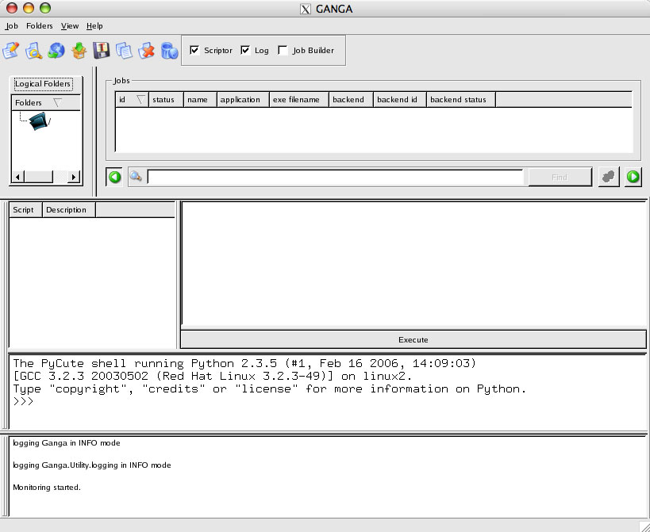
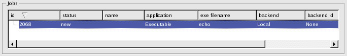
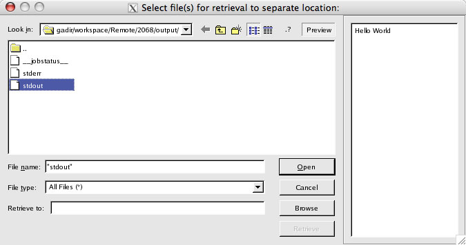

Quick Start
===========
In this section, you will submit a simple GANGA ``Hello World`` job just to get a feel of how the GANGA GUI works.

Step 1 - Start GANGA GUI
------------------------
At the console, start GANGA with the GUI as the front-end by giving the ``--gui`` argument::
      
   $ ganga --gui

If it's your first time running GANGA, you will be presented with the following lines::

   *** Welcome to Ganga ***
   Version: CVS_HEAD
   Documentation and support: http:/cern.ch/ganga
   Type help() or help('index') for online help.
   
   It seems that you run Ganga for the first time and you do not have the
   config file: ~/.gangarc
   
   Would you like to create config file with standard settings ([y]/n) ?y
   Created standard config file /home/clat/.gangarc
   
   Press <Enter> to continue.

As requested, create a new GANGA config file with standard settings and hit **Enter** to continue. There may be more log messages filling your console window but you will eventually be presented with a GUI that looks much like this:

   
   Figure 2-1: Ganga GUI start-up view

Step 2 - Build job
------------------
To create a new GANGA job, click on the |New Job| icon (leftmost icon on the toolbar).

The Job Builder window (see Figure 2-2) will appear allowing you to build a new GANGA job. In this example, Job 2068 was created showing a list of *Job attributes*. Expand the application attribute to reveal its constituent attributes. Click on *exe* and you will see that this job will run the executable ``echo``. Click on *args* to see the argument (*Hello World* in this case) that will be passed to the executable.

.. figure:: quickstart_pic_2.jpg

   Figure 2-2: Creating a new job with the Job Builder.

The *monitoring* panel (i.e. the table-like widget with headings just below the toolbar) in the main GANGA GUI window, will correspondingly show the new job that you have just created.

   
   Figure 2-3: Newly created job in the monitoring panel.

Step 3 - Submit job
-------------------
You are now ready to submit the *Hello World* job. To submit, simply click on  |Submit button| in the Job Builder window (top-right corner).

In the *monitoring* panel, the job's status will change and eventually become *completed*.

.. figure:: quickstart_pic_4.jpg

   Figure 2-4: Job has successfully completed.

Step 4 - Retrieve result
------------------------
To retrieve the job's output, right-click on the job entry (in the *monitoring* panel) and select *Retrieve output* to display the *Retrieve output* dialog box. 
Select the *stdout* file and click on the |Preview| button (top-right corner) in the dialog box to preview its contents.

   Figure 2-5: Retrieve output of the job.

To save the output file (i.e. *stdout*) to a separate location, click on the |Browse| button and choose a directory from file browse dialog. Once a directory is selected, click on the |Retrieve| button.

.. |Preview| image:: preview.jpg
.. |Browse| image:: browse.jpg
.. |Retrieve| image:: retrieve.jpg
