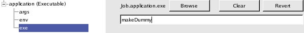
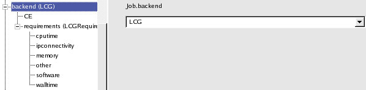
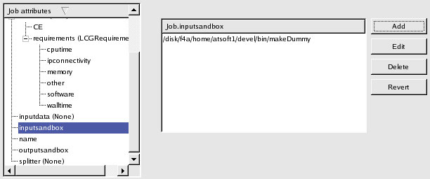
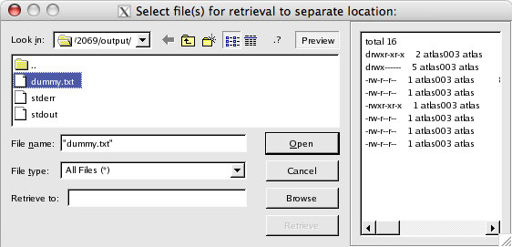

Examples
========
Below are step-by-step examples of three different types of jobs being built and run using the GANGA GUI.

   - `Generic job`_
   - `ATLAS job`_
   - `LHCb job`_

Generic job
-----------
This is an extension to the *Hello World* job described previously. This time, you will get to build a generic job, run it and retrieve its results.

In this example, we have a very simple script called *makeDummy* which dumps the contents of the directory it is currently in into a file called *dummy.txt*. You can download it from here__ (you may have to *right-click* on the link and save it explicitly). We will now build a GANGA job that will run this script on LCG.

__ http://ganga.web.cern.ch/ganga/GangaGUI/scripts/makeDummy
.. IMPORTANT::
   You will need a valid grid certificate to submit jobs to LCG.

Step 1 - Build job
""""""""""""""""""
Click on the |New Job| icon on the toolbar.

The Job Builder window (if it's not already visible) will appear allowing you to build a new GANGA job. As before, you will be presented with a list of *Job attributes* for the new job you have just created.
 
   1. Expand the *application* attribute to reveal its constituent attributes. 
   2. Click on *exe* and replace the current value with *makeDummy*.

   Figure 4-1-1: Change the exe value to makeDummy.

   3. Click on *args* and delete the existing *Hello World* argument (using the delete button on the right) as our *makeDummy* script does not take any arguments.
   4. The *backend* attribute should (currently) be set to *Local*. Change this to *LCG*. You may see what constituent attributes *LCG* has but there is no need to change any of its attributes.

   Figure 4-1-2: Backend changed to LCG.

   5. Click on *inputsandbox* and add the *makeDummy* script to the list. All entries in this list will be transferred to the worker node (on LCG in this case).

   Figure 4-1-3: Add the script to the inputsandbox.

   6. Click on *outputsandbox* and add *dummy.txt* to the list. This tells GANGA to retrieve *dummy.txt* from the worker node when the job has completed.

Step 2 - Submit job
"""""""""""""""""""
   7. Click on the |Submit| tool button. Refer to the *monitoring* panel to follow the progress of the job. In the *monitoring* panel, the job's status will change and eventually become *completed*.

.. _`result retrieval`:

Step 3 - Retrieve result
""""""""""""""""""""""""
   8. Once the job has successfully completed, *left-click* on the job in the *monitoring* panel to highlight it and click on the |Retrieve Output| button in the toolbar. Click the |Preview| button to see the contents of the selected file.

      - If you wish to retrieve *dummy.txt* to an alternative location, click on the |Browse| button to choose a directory from the directory browse dialog and then click *OK*. The selected directory will be displayed and the |Retrieve| button will be enabled. Click on it to initiate the retrieval.
      - Alternatively, you can open the selected file using your favourite editor or any other suitable application. With *dummy.txt* selected, assuming GANGA GUI knows how to handle *.txt* files (see `Configuring file associations`_), simply click the |Open| button.

   Figure 4-1-4: Retrieve results (i.e. dummy.txt) of the job.

ATLAS job
---------
To be completed...

LHCb job
--------
To be completed...

.. |Browse| image:: browse.jpg

.. _`Configuring file associations`: gangagui-manual-chapter_5.html#configuring-file-associations