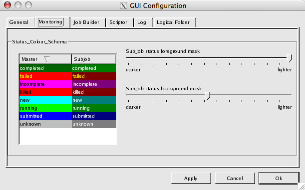

GUI Customisation
=================
GANGA GUI maintains a configuration file ``~/gangadir/gui/GangaGUI.cfg``. However, this file is not designed to be modified by the user. Customisation can be achieved through the GUI Customisation dialog invoke by navigating the menubar to *View > GUI Configuration*.

Configurable items are grouped into several categories: *General*, *Monitoring*, *Job Builder*, *Scriptor*, *Log* and *Logical Folder*. The majority of the configurable items are self-explanatory. There are, however, several more complex  configurable items and these will be described briefly below.

   - `General configurations`_
      - `File associations`_
      - `Invoking external applications`_
   - `Monitoring configurations`_
      - `Status colour schema`_
   - `Job Builder configurations`_
   - `Scriptor configurations`_
   - `Log configurations`_
   - `Logical Folder configurations`_

.. TIP:: 
   As with most other widgets, move the mouse pointer over individual widgets and tooltips will appear explaining what the widgets do and how to use them. You may have to move the mouse over the headers of list widgets to see their associated tooltips.

   Figure 5-1: GUI Configuration dialog.

.. _`Configuring file associations`:

General configurations
----------------------

File associations
"""""""""""""""""
GANGA GUI allows retrieved output files to be opened with specific applications defined by the user. Refer to section on `result retrieval`_. Tick the checkbox for external applications that have graphical user interfaces (GUIs). This tells the GANGA GUI not to invoke the external application in a shell. Conversely, if the external application needs to execute in a shell (i.e. console application), untick the checkbox.

.. figure:: guiconfig_pic_2.jpg

   Figure 5-2: Specifying file extension associations.

Invoking external applications
""""""""""""""""""""""""""""""
External applications can be invoked from within GANGA GUI to access output results (i.e. output files generated from job runs). However, many of these external applications do not have GUIs and will run in the console window used to start GANGA GUI. This is typically not the desired behaviour. To start these non-GUI external applications in separate console windows, they have to be started in their own shells. On Linux and Mac OS X, these applications can to be run from a new shell session by pre-pending ``xterm -e`` to the external application e.g. ``xterm -e pico``. The shell invocation command is specified in the ``Shell_Command`` configuration and is used when the file association indicates that the external application does not have a GUI.

.. figure:: guiconfig_pic_3.jpg

   Figure 5-3: Specifying the shell command to open external applications with no GUIs.

Monitoring configurations
-------------------------

Status colour schema
""""""""""""""""""""
Job status have associated colours that are used in the monitoring panel. This colour assignment can be customised. By clicking on a specific status in the *Master* column (corresponding to master job status), a context-sensitive menu pops up allowing the user to further select the foreground or background to customise.

Subjob colour customisation has been deliberately restricted. Foreground and background sliding bars adjust brightness but not colour. This is to minimise unnecessary confusion that may arise if master jobs and subjobs with the same status are assigned different colours.

.. figure:: guiconfig_pic_4.jpg

   Figure 5-4: Defining the colours used in the monitoring panel.

Job Builder configurations
--------------------------
To be completed...

Scriptor configurations
-----------------------
To be completed...

Log configurations
------------------
To be completed...

Logical Folder configurations
-----------------------------
To be completed...

.. _`result retrieval`: gangagui-manual-chapter_4.html#result-retrieval